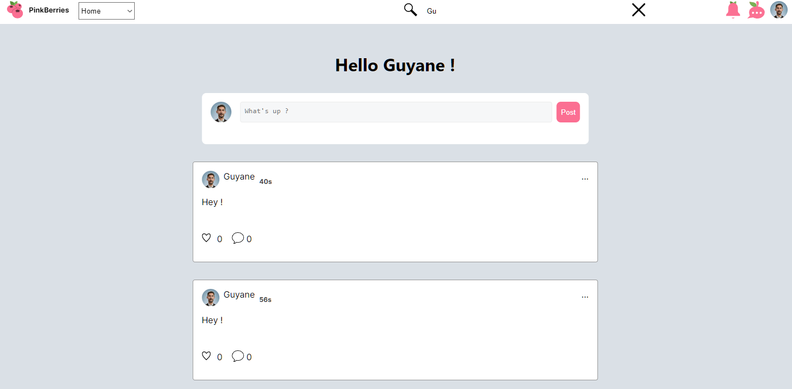

# PinkBerries 🫐

PinkBerries is a social network that follow [fireship's Nextjs course](https://fireship.io/courses/nextjs/). The project is built using a combination of Prisma △, Neon 🌟 (PostgreSQL database), OAuth 🔐, React ⚛️, and Next.js 🚀. You can easily follow and discuss with your friend, edit your profile, like posts.

# Key Technologies
**Prisma** △: Used for simplified communication with the PostgreSQL database 🐘.

**Neon** 🌟: The PostgreSQL database ensures efficient data management.

**OAuth** 🔐: Provides secure user authentication.

**React** ⚛️: Creates a dynamic and responsive user interface.

**Next.js** 🚀: Optimizes performance and development speed.





## Getting Started

First, run the development server:

```bash
npm run dev
# or
yarn dev
# or
pnpm dev
```

Open [http://localhost:3000](http://localhost:3000) with your browser to see the result.

You can start editing the page by modifying `app/page.tsx`. The page auto-updates as you edit the file.
